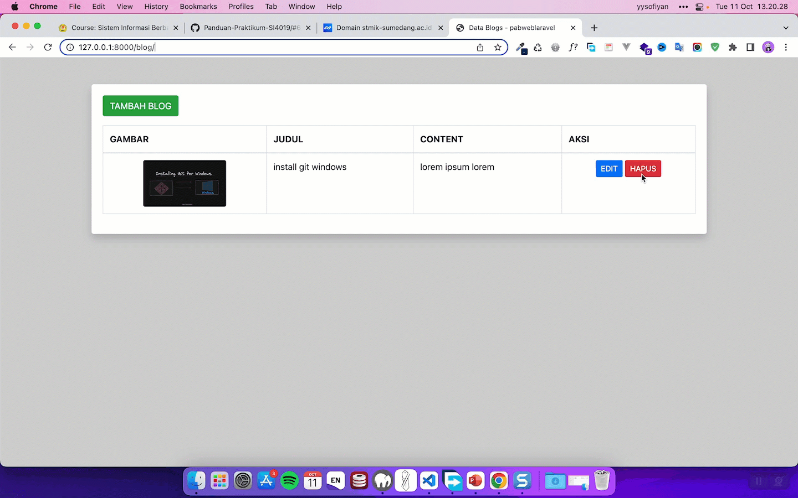

Halo teman-teman semuanya, di praktikum sebelumnya kita sudah berhasil belajar banyak bagaimana cara membuat proses edit dan update data di dalam Laravel 8. Dan sekarang kita akan lanjutkan untuk belajar bagaimana cara membuat proses delete data di dalam Laravel 8. Dan disini kita hanya akan membuat `1 function` di dalam `controller Blog`. Langsung saja kita mulai.

## Langkah 1 - Membuat Function Destroy

Disini kita akan menambahkan `1 function` di dalam `controller blog`, silahkan buka file `app/Http/Controller/BlogController.php` kemudian silahkan tambahkan kode berikut ini tepat di bawah `function update`:

```php
/**
* destroy
*
* @param  mixed $id
* @return void
*/
public function destroy($id)
{
  $blog = Blog::findOrFail($id);
  Storage::disk('local')->delete('public/blogs/'.$blog->image);
  $blog->delete();

  if($blog){
     //redirect dengan pesan sukses
     return redirect()->route('blog.index')->with(['success' => 'Data Berhasil Dihapus!']);
  }else{
    //redirect dengan pesan error
    return redirect()->route('blog.index')->with(['error' => 'Data Gagal Dihapus!']);
  }
}
```

Di atas kita mencari data blog berdasarkan `ID` dengan kode berikut ini :

```php
$blog = Blog::findOrFail($id);
```

Kemudian jika data blog ditemukan, kita akan lakukan hapus data image yang ada di sever sesuai dengan nama field image.

```php
Storage::disk('local')->delete('public/blogs/'.$blog->image);
```
Dan yang terakhir kita hapus data blog tersebut dari table menggunakan kode seperti berikut ini :

```php
$blog->delete();
```
## Langkah 2 - Menjalankan Project

Sekarang kita bisa mencoba menjalankan atau menguuji proses delete data, jika kita klik delete maka kurang lebih akan menampilkan alert konfirmasi, apakah yakin data tersebut ingin dihapus.

Dan jika kita klik `OK`, maka proses `delelete` akan dijalankan dan akan menampilkan pesan sukses hapus data, kurang lebih seperti berikut ini :



Sampai disini pembahasan dan belajar kita tentang bagaimana cara membuat CRUD sederhana menggunakan Laravel 8 dan Bootstrap. 

